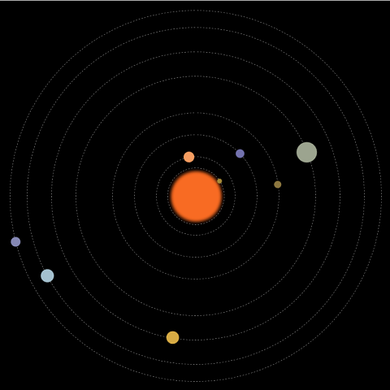
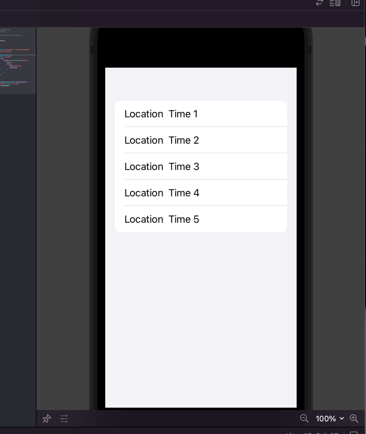

# Timescope

## What is Timescope?

Timescope is a IOS app that uses the homescreen widgets on iphone to show the most relevant time zones 
to you with ease of access instead of needing to open an app. Timescope also displays a 2d model of 
our solar system displaying where the planets are currently located.

Timescope gives you interesting visual data and a different perspective of 
the current time and how we measure time as humans.

## Project plans and concepts
I want to put a live 2D model of the solar system in accordance to our time and display it for the user
to see while checking their time zones.

Here are current updates to the main screen user interface to set which time zones you want displayed in the Timescope widget

This is the app icon I designed for this app

